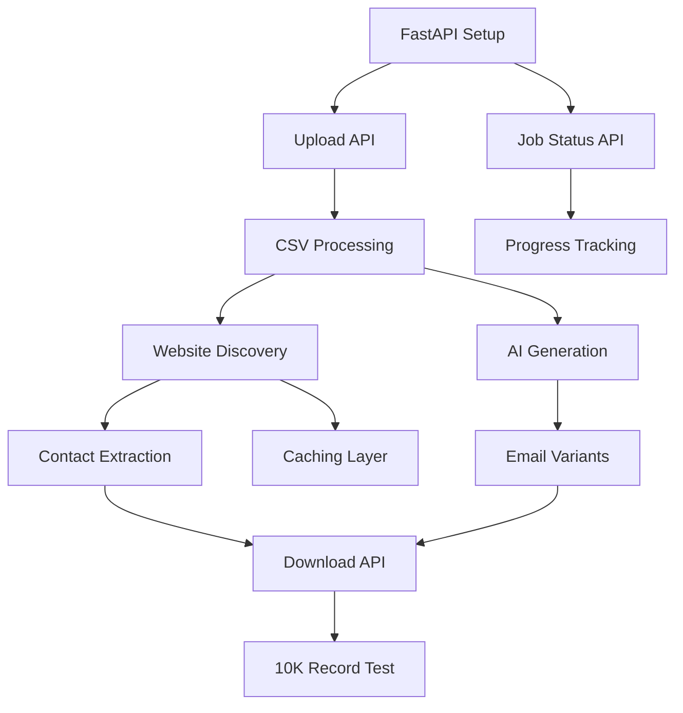

# Prioritized Product Backlog - MVP

## Backlog Prioritization Framework

**Priority Levels:**
- **P0 (Critical)**: Must have for MVP - demo will fail without these
- **P1 (High)**: Should have - significantly improves demo quality
- **P2 (Medium)**: Nice to have - can be added if time permits
- **P3 (Low)**: Future enhancement - post-MVP

**Prioritization Criteria:**
1. Demo Impact (40%) - Will this wow the Florida dealers?
2. Technical Dependency (30%) - Do other features need this?
3. Risk Reduction (20%) - Does this reduce project risk?
4. Effort/Value Ratio (10%) - Quick wins prioritized

---

## Sprint 1: Foundation (Week 1)
**Goal:** Basic upload → enrichment → download pipeline working end-to-end

| Priority | Story ID | Story | Points | Assignee |
|----------|----------|-------|--------|----------|
| P0 | US-1.1 | Upload CSV File | 3 | Dev 3 (Frontend) |
| P0 | US-4.1 | Simple Web Upload Interface | 5 | Dev 3 (Frontend) |
| P0 | US-2.1 | Discover Company Website | 5 | Dev 2 (Pipeline) |
| P0 | US-2.3 | Generate Personalized Email Content | 5 | Dev 4 (AI) |
| P0 | - | FastAPI Setup & Job Model | 3 | Dev 1 (API) |
| P0 | - | Database Schema Implementation | 2 | Dev 1 (API) |

**Sprint 1 Total: 23 points**

**Deliverable:** Can upload a CSV, enrich with website + AI email, see results in console

---

## Sprint 2: Core Features (Week 2)
**Goal:** Complete enrichment pipeline with all data points and proper job management

| Priority | Story ID | Story | Points | Assignee |
|----------|----------|-------|--------|----------|
| P0 | US-1.2 | View Job Status | 2 | Dev 1 (API) |
| P0 | US-1.3 | Download Enriched Results | 2 | Dev 1 (API) |
| P0 | US-2.4 | Handle Bulk Processing | 8 | Dev 2 (Pipeline) |
| P1 | US-2.2 | Extract Contact Information | 5 | Dev 2 (Pipeline) |
| P1 | US-3.1 | Implement Caching Layer | 3 | Dev 2 (Pipeline) |
| P1 | US-5.1 | Input Validation | 3 | Dev 3 (Frontend) |

**Sprint 2 Total: 23 points**

**Deliverable:** Full pipeline with progress tracking, bulk processing, and caching

---

## Sprint 3: Polish & Scale (Week 3)
**Goal:** Production-ready system that can handle 10,000 records reliably

| Priority | Story ID | Story | Points | Assignee |
|----------|----------|-------|--------|----------|
| P1 | US-5.2 | Error Recovery | 5 | Dev 2 (Pipeline) |
| P2 | US-3.2 | Track API Usage and Costs | 3 | Dev 1 (API) |
| P2 | US-4.2 | Job History View | 3 | Dev 3 (Frontend) |
| P0 | - | Integration Testing | 4 | All |
| P0 | - | Performance Optimization | 4 | Dev 2 |
| P0 | - | Docker Deployment | 2 | Dev 1 |

**Sprint 3 Total: 21 points**

**Deliverable:** Production-ready MVP deployed and tested with 10K records

---

## Backlog (Post-MVP)

### Phase 2 Features (Month 2)
| Priority | Feature | Description | Points |
|----------|---------|-------------|--------|
| P1 | Conversation Engine | Handle email responses | 40 |
| P1 | Email Integration | IMAP/SMTP setup | 13 |
| P1 | Response Classification | Intent detection | 8 |
| P2 | Advanced Templates | Industry-specific | 5 |

### Phase 3 Features (Month 3)
| Priority | Feature | Description | Points |
|----------|---------|-------------|--------|
| P1 | CRM Integration | HubSpot webhook | 13 |
| P1 | CRM Integration | Pipedrive webhook | 13 |
| P2 | CRM Integration | GoHighLevel | 13 |
| P2 | Calendar Integration | Calendly/Cal.com | 8 |

### Phase 4 Features (Month 4)
| Priority | Feature | Description | Points |
|----------|---------|-------------|--------|
| P2 | Analytics Dashboard | React/Vue frontend | 21 |
| P2 | Advanced Reporting | Usage analytics | 13 |
| P3 | White Label | Customizable branding | 8 |
| P3 | API Access | Developer API | 13 |

---

## Critical Path Analysis

### Dependencies That Could Block Progress:

### Critical Path:
1. FastAPI Setup (Day 1-2)
2. Upload API (Day 2-3)
3. Website Discovery (Day 3-5)
4. AI Generation (Day 4-6)
5. Download API (Day 7-8)
6. Bulk Processing (Day 9-11)
7. 10K Record Test (Day 12-15)

---

## Resource Allocation

### Developer Assignments:

**Dev 1 (API/Backend Lead)**
- FastAPI setup and configuration
- Job management endpoints
- Database operations
- Docker deployment
- Total: 15 points

**Dev 2 (Pipeline/Enrichment Lead)**
- Enhance existing enricher
- Implement caching
- Bulk processing optimization
- Error recovery
- Total: 26 points

**Dev 3 (Frontend/UX Lead)**
- Upload interface
- Status tracking UI
- Job history view
- Input validation
- Total: 14 points

**Dev 4 (AI/Content Lead)**
- LLM integration
- Prompt optimization
- Email generation
- Content quality
- Total: 12 points

---

## Minimum Viable Product Definition

### Must Have (P0) - 38 points
✅ CSV upload  
✅ Website discovery  
✅ AI email generation  
✅ Bulk processing (10K records)  
✅ Download results  
✅ Basic web interface  

### Should Have (P1) - 16 points
✅ Contact extraction  
✅ Caching for cost reduction  
✅ Input validation  
✅ Error recovery  

### Could Have (P2) - 6 points
⭕ Cost tracking  
⭕ Job history  

### Won't Have (this release)
❌ Email conversations  
❌ CRM integrations  
❌ Analytics dashboard  

---

## Release Criteria

### MVP Ready When:
1. ✅ All P0 stories complete
2. ✅ 10,000 record test passes
3. ✅ Cost per record < $0.02
4. ✅ Success rate > 95%
5. ✅ Docker deployment working
6. ✅ Basic documentation complete

### Go/No-Go Checklist:
- [ ] Florida dealer CSV processes successfully
- [ ] Enrichment quality spot-checked (20 samples)
- [ ] Performance meets targets
- [ ] No critical bugs
- [ ] Deployment instructions verified
- [ ] Demo script prepared

---

## Velocity Tracking

**Expected Velocity:** 15-20 points per developer per sprint

**Sprint 1 Target:** 23 points (achievable with 4 devs)  
**Sprint 2 Target:** 23 points  
**Sprint 3 Target:** 21 points  

**Total MVP:** 67 story points in 3 weeks

**Buffer:** 20% contingency built into estimates

---

## Backlog Grooming Schedule

**Weekly Sessions:**
- Monday: Sprint planning (2 hours)
- Wednesday: Backlog refinement (1 hour)
- Friday: Sprint review & retro (1.5 hours)

**Daily Standups:** 15 minutes at 9 AM

---

## Technical Debt Register

### Acceptable for MVP:
- SQLite instead of PostgreSQL
- Basic error messages
- Simple UI styling
- No user authentication
- Limited test coverage (>60%)

### Must Fix Post-MVP:
- Add comprehensive logging
- Implement rate limiting
- Add user authentication
- Increase test coverage (>80%)
- PostgreSQL migration